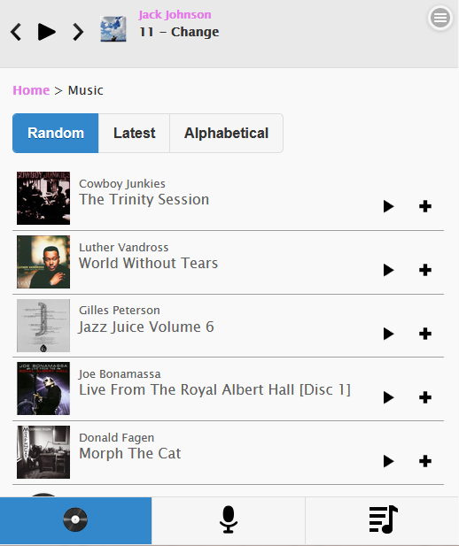
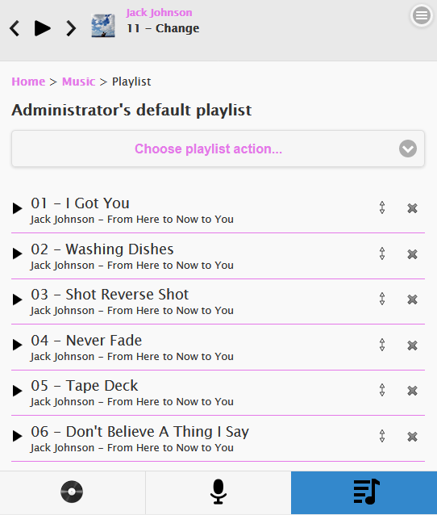
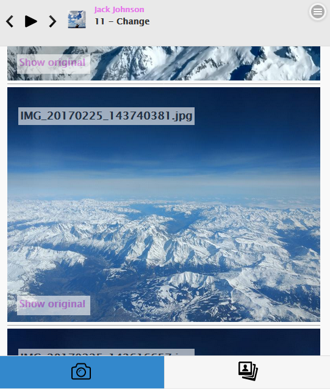

# Mashup Media
***
Mashup Media is a free, online, open source HTML5 media centre designed to play, listen, view, manage and share your music, videos and pictures safely and securely just using a modern web browser supported on all devices.

Mashup Media eliminates the need to worry about online privacy and corporate small print, it puts you back in control of your media content. Share your files with friends, family, colleagues using groups to seperate who can access what. Your private life remains private and you can choose who you want to share it with.

## Music

Add as many music libraries as you like and Mashup Media will provide a clean, elegant interface to quickly access and play your tunes.
### Compatibility
You can listen to your music on all modern html5 compatible web browsers on desktop, tablet and mobile devices.
### Playlists
You can create and share music playlists.

### Support for many music formats 
Mashup Media uses  to provide support for the most common music encoding formats.

## Photos

Photos are grouped in albums and managed in libraries. Mashup Media compresses your photos to small web friendly files but provides a link to the original image.

## Videos
Many file formats are supported using . Videos are listed clearly and are managed by libraries.

## Configuration
Mashup Media should work out of the box.

## Technology
Mashup Media is developed in Java, html and javascript. It will work as either a standalone file or embedded in a Java web server such as . Mashup Media will run in almost environments such as Windows, Mac and Linux.

## Instructions

